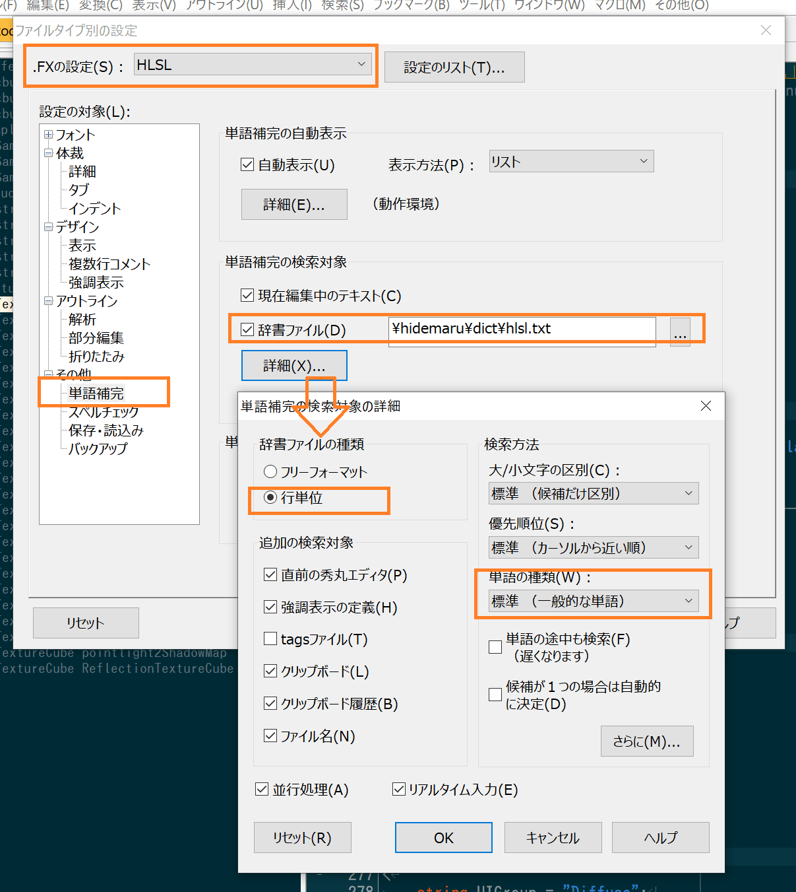
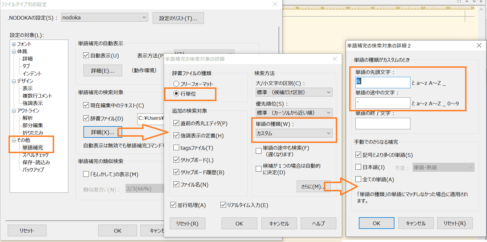
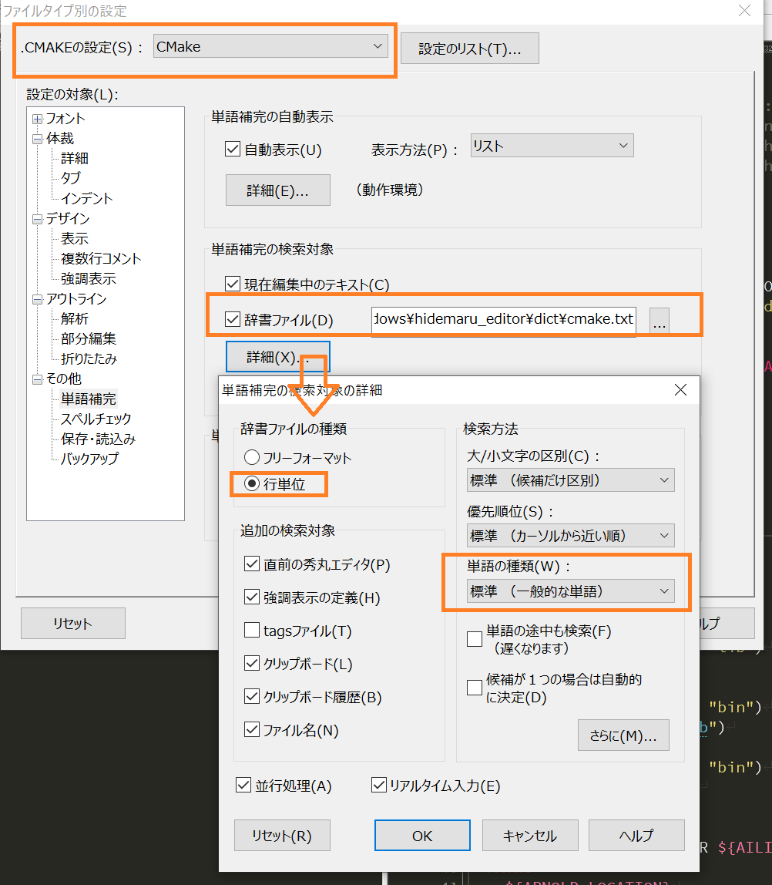
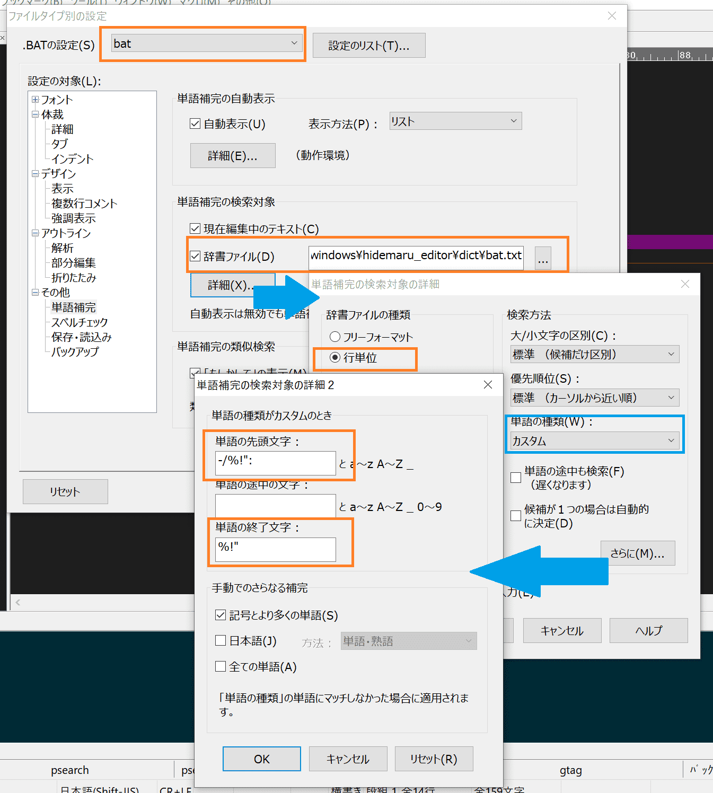
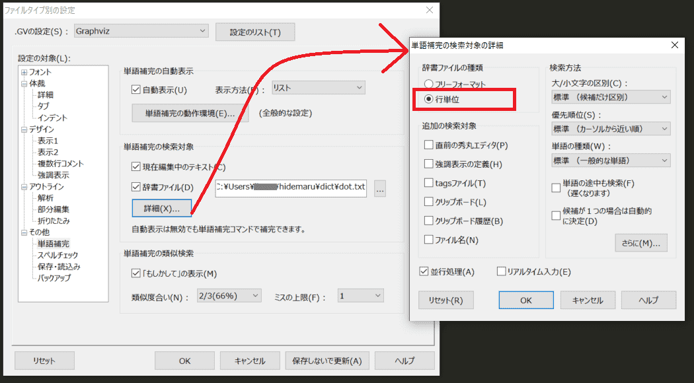

# 秀丸エディタの辞書ファイル

辞書一覧

- [MEL Script(Autodesk MAYA 2019)](#mel-scriptautodesk-maya-2019)
- [HLSL](#hlsl)
- [のどか](#のどか)
- [CMake](#cmake)
- [bat](#bat)
- [c++](#c)
- [Graphviz](#graphviz)

# MEL Script(Autodesk MAYA 2019)

MAYA MEL Scriptの辞書ファイルです。

## 補足

MELコマンド一覧は以下の一行スクリプトで得ています。（約5000個の単語をリストアップしています）

	help -l "*";

## ファイル

[maya_mel.txt](files/maya_mel.txt)

# HLSL

HLSL(High Level Shading Language)の辞書ファイルです。

約900個の単語が含まれています。MAYAとSoftimage XSI特有の単語も登録しています。

## 設定方法

## ファイル

[hlsl.txt](files/hlsl.txt)

## 謝辞
- [hlsl.vim](https://github.com/beyondmarc/hlsl.vim)

かなり参考にしました、感謝😘

# のどか

[汎用キーバインディング変更ソフト「のどか」](https://appletllc.com/web/nodoka.htm)の辞書ファイルです。

## 辞書に含まれる内容

|項目|内容|
|:--:|:--:|
|真偽値|enable,disable,...|
|命令|key,keymap,...|
|オプション|ats4nodoka,before-key-down...|
|Function|&CancelPrefix,&ClipboardCopy,...|

## 単語補完の検索対象の詳細

以下キーワードを候補に挙げるため、

- &CancelPrefix, ...
- before-key-down, ...

単語補完を下記画像のように設定してください。

## ファイル

[nodoka.txt](files/nodoka.txt)

# CMake

[CMake](https://cmake.org/)（ビルド自動化のためのフリーソフトウェア）の辞書ファイルです。

約1300個の単語が登録されています。

## 設定方法

## ファイル

[cmake.txt](files/cmake.txt)

## 謝辞
- [cmake.vim : CMake syntax highlighting ](https://www.vim.org/scripts/script.php?script_id=600)
- [CMake plugin for IntelliJ Idea CE and Android Studio](https://github.com/ArtsiomCh/CMake)

かなり参考にしました、感謝😘

# bat

Windowsバッチファイルの辞書です。

## 辞書に含まれる内容

|項目|内容|
|:--:|:--:|
|コマンド|if,md,enabledelayedexpansion,...,IF,MD,ENABLEDELAYEDEXPANSION,...|
|利用頻度が高い環境変数|homedrive,temp,...,HOMEDRIVE,TEMP,...|

大文字版と小文字版の単語を登録しました。

## 単語補完の検索対象の詳細

## ファイル

[bat.txt](files/bat.txt)

# c++

c++の辞書ファイルです。

C/C++標準ライブラリ、STL、VisualStudioなどから約4000個の単語を登録しています。

## 辞書に含まれる内容

|バージョン|対応状況|
|--|--|
|C++11|○|
|C++14|○|
|C++17|×|
|C++20|×|
|C++23|×|

各バージョンの単語をできるだけ登録したつもりですが抜けは色々あると思います😅

C++警察の皆様におかれましては静観していただきますとありがたいです。

## ファイル

[cpp.txt](files/cpp.txt)

## 謝辞
- [https://github.com/octol/vim-cpp-enhanced-highlight](https://github.com/octol/vim-cpp-enhanced-highlight)
- [http://www.vim.org/scripts/script.php?script_id=4293](http://www.vim.org/scripts/script.php?script_id=4293)
- [http://www.vim.org/scripts/script.php?script_id=2224](http://www.vim.org/scripts/script.php?script_id=2224)
- [http://www.vim.org/scripts/script.php?script_id=1640](http://www.vim.org/scripts/script.php?script_id=1640)
- [http://www.vim.org/scripts/script.php?script_id=3064](http://www.vim.org/scripts/script.php?script_id=3064)

# Graphviz

[Graphviz](http://graphviz.org/)（Dot言語で記述されたグラフ構造を画像ファイルへ出力するツール）の辞書ファイルです。

約1400個の単語を登録しました。

## 設定方法

## ファイル

[graphviz_dic.txt](files/dot.txt)

# ダウンロード

[filesフォルダ](files)から必要なファイルをダウンロードしてください。

# 連絡先

- <https://ohtorii.hatenadiary.jp>
- <https://twitter.com/ohtorii>
- <https://github.com/ohtorii>

# 寄付

もし気に入ってくれたらSteamからゲームを寄付してくれるとうれしいです😘
- https://store.steampowered.com/wishlist/id/ohtorii

開発の励みになります。
