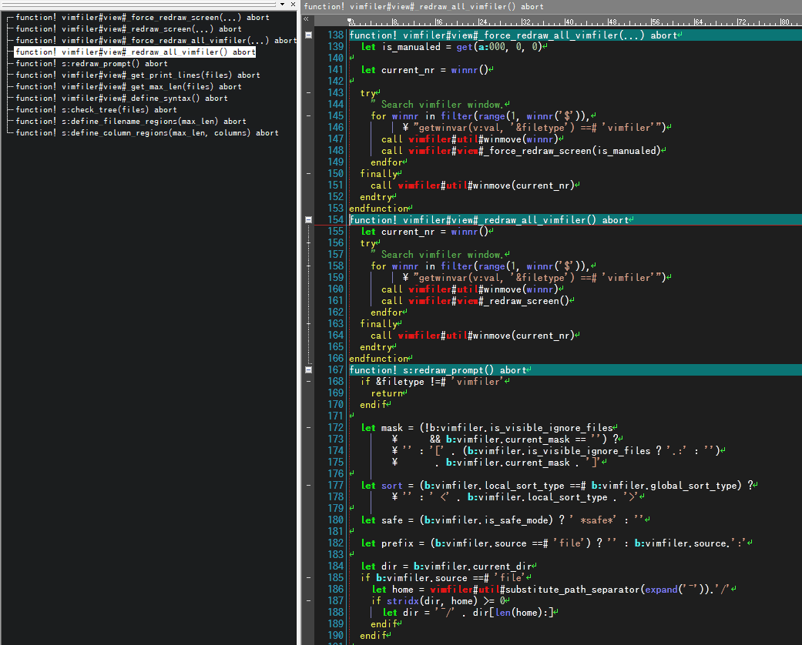
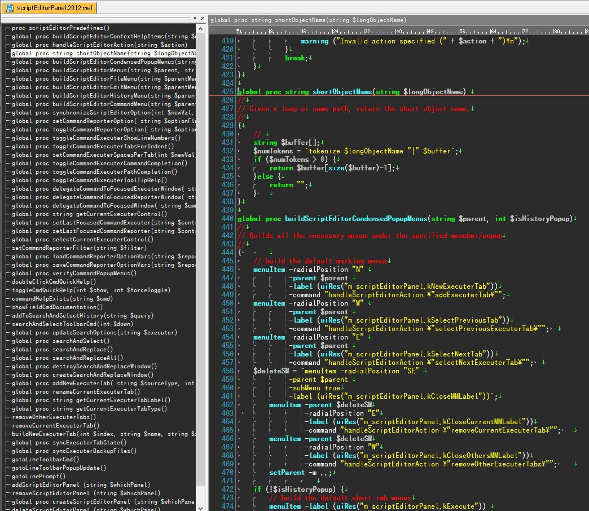
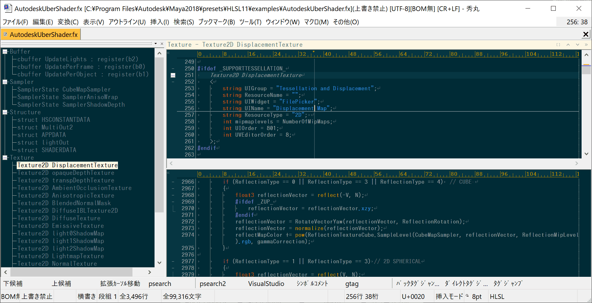
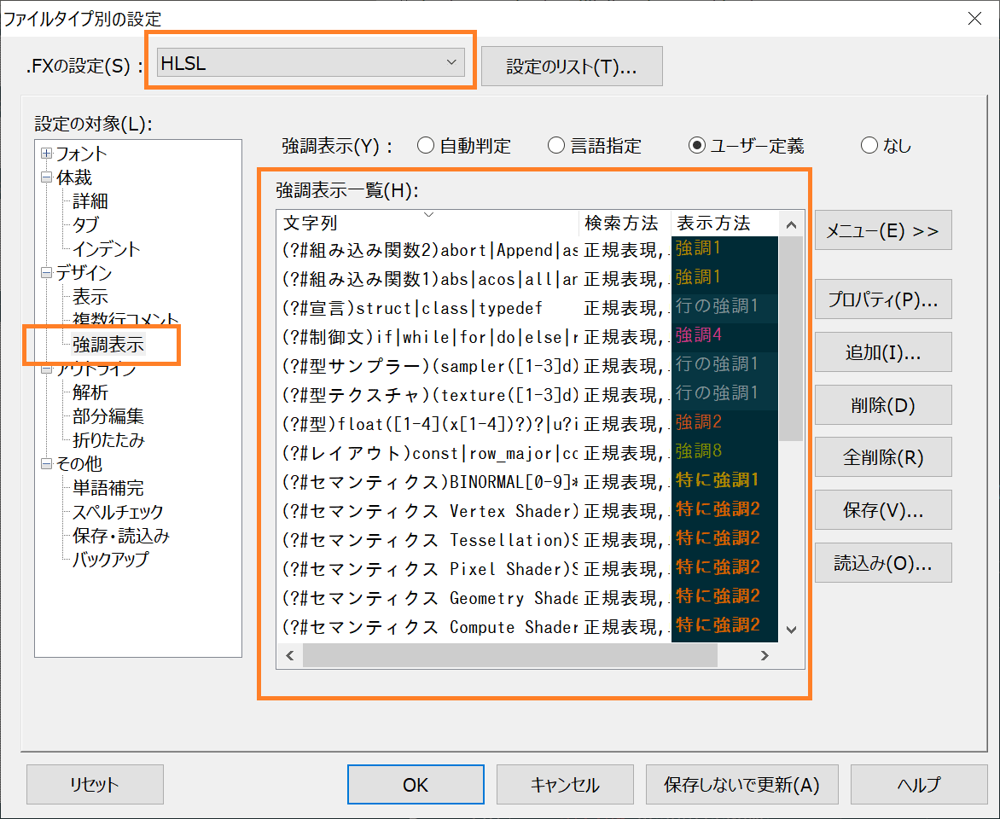
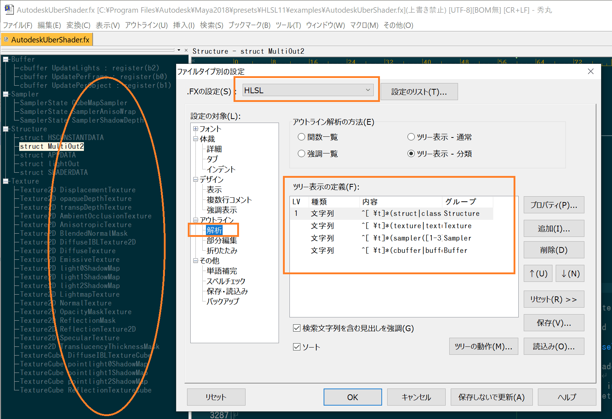
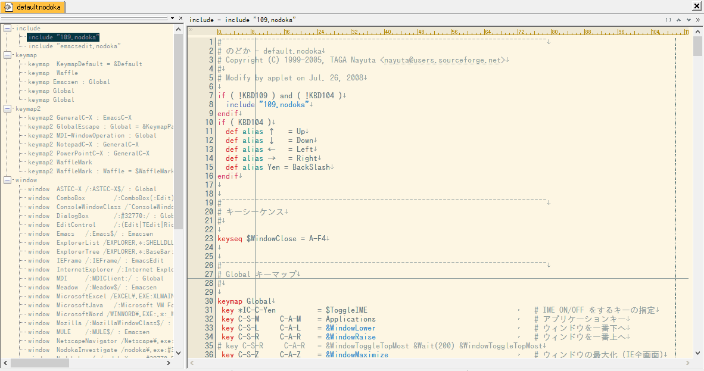
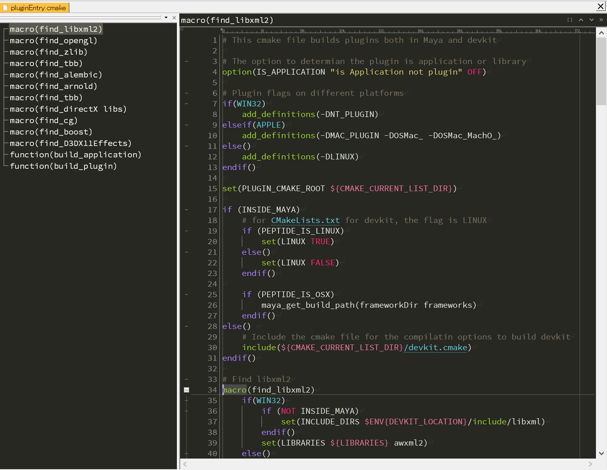
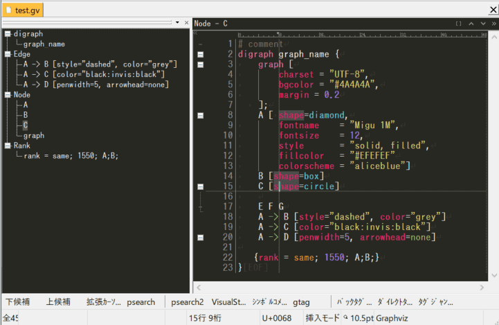
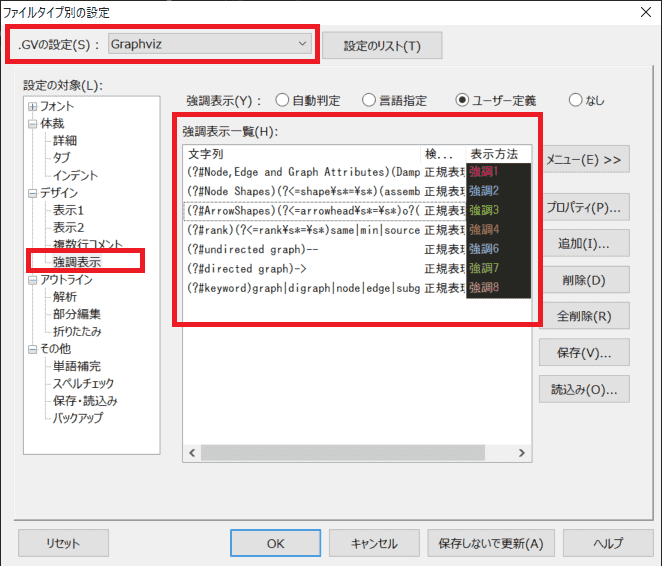
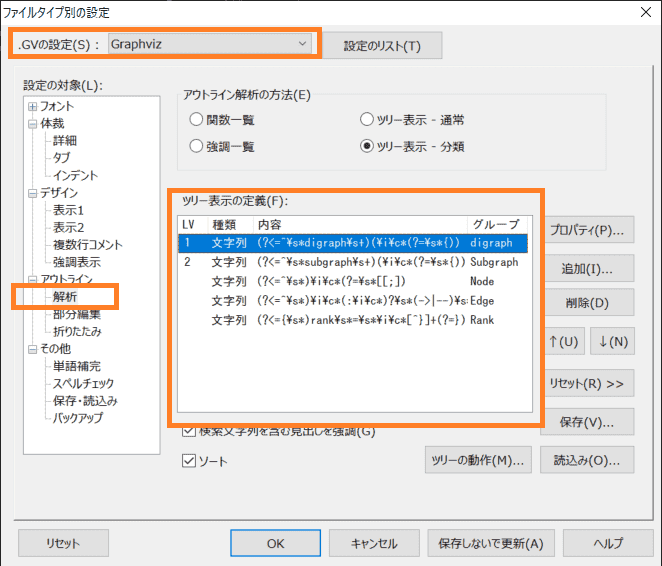

# 秀丸エディタのハイライト設定集

もくじ

- [Vim script](#vim-script)
- [Shell Script(Bash)](#shell-scriptbash)
- [MEL Script(Autodesk MAYA 2019)](#mel-scriptautodesk-maya-2019)
- [MaxScript(Autodesk 3D Studio MAX)](#maxscriptautodesk-3d-studio-max)
- [HLSL](#hlsl)
- [のどか](#のどか)
- [CMake](#cmake)
- [Graphviz](#graphviz)
- [ダウンロード](#ダウンロード)
- [連絡先](#連絡先)

# Vim script

VIMスクリプトのコードリーディングを主目的として以下方針で作成しました。

- 文字列とコメントは正確に強調する
- それ以外は多少の間違いを許容する

スクリーンショット

強調表示定義ファイルを読み込むときに「カラー」を選択すると、上のスクリーンショットと同じ配色になります。

## 強調するもの

- 組み込み関数
- コマンド
- 制御構文
- 変数スコープ
- ネームスペース
- 関数

## ファイル
[vim.hilight](files/vim.hilight)

# Shell Script(Bash)

## ファイル

[shell.hilight](files/shell.hilight)

# MEL Script(Autodesk MAYA 2019)

以下方針で作成しました。
- MAYA 2019のスクリプトエディタのカラー表示にできるだけ近づける。
- proc定義はできるだけ正確に解析する。

スクリーンショット

## ファイル

[maya_mel.hilight](files/maya_mel.hilight)

## 補足

- 強調表示定義ファイルを読み込むときに「カラー」を選択すると、上のスクリーンショットと同じ配色になります。
- 「ファイルメニュー→その他→ファイルタイプ別の設定→その他→単語補完→詳細(X)→強調表示の定義」の設定をONにすることでMELコマンド名の補完（約5000個）が効くようになります。

# MaxScript(Autodesk 3D Studio MAX)

ここ10年以上メンテしていませんが、とりあえずアップしました😅😅😅

## ファイル

[maxscript.hilight](files/maxscript.hilight)

# HLSL	

HLSL(High Level Shading Language)の強調表示です。

スクリーンショット

強調表示定義ファイルを読み込むときに「カラー」を選択すると、上のスクリーンショットと同じ配色になります。

## 強調するのも

- 型(float,half4x4,min10float4x4...)
- レイアウト指定(row_major,column_major...)
- 組み込み関数(abs,sin...)
- 制御文(if,while...)
- Swizzling(xyzw,xxyy...)
- セマンティクス(NORMAL,TESSFACTOR,SV_DispatchThreadID...)
- サンプラー(sampler2d...)
- テクスチャ(texture2d,texturecube...)
- バッファ(cbuffer,rwstructuredbuffer...)
- ストレージクラス(in,out,static...)
- アトリビュート(maxvertexcount,domain...)
- 構造体(struct...)
- プリプロセッサ(#if,#endif...)
- profile(techniques,fp40...)

見ての通り要素毎に細かく分けています、なので、好みに応じた配色にしてください。
あと、不要な要素を削除することでシンプルなハイライトに出来ます。

## アウトライン

## ファイル

[hlsl.hilight](files/hlsl.hilight)

# のどか

[汎用キーバインディング変更ソフト「のどか」](https://appletllc.com/web/nodoka.htm)の強調表示です。

スクリーンショット

強調表示定義ファイルを読み込むときに「カラー」を選択すると、上のスクリーンショットと同じ配色(solarized-light)になります。
solarized-lightは[https://github.com/Harurow/Hidemaru-Settings](https://github.com/Harurow/Hidemaru-Settings)を使わせて貰いました😃😃😃

## ファイル

[nodoka.hilight](files/nodoka.hilight)

# CMake

[CMake](https://cmake.org/)（ビルド自動化のためのフリーソフトウェア）の強調表示です。

スクリーンショット

強調表示定義ファイルを読み込むときに「カラー」を選択すると、上のスクリーンショットと同じ配色(monokai)になります。

カラー定義は[monokai-color.hilight(rev.1.1)](http://www.wellformed.org/2016/hidemaru/monokai-color/)を使わせて貰いました😃😃😃

## 謝辞
- [cmake.vim : CMake syntax highlighting ](https://www.vim.org/scripts/script.php?script_id=600)
- [CMake plugin for IntelliJ Idea CE and Android Studio](https://github.com/ArtsiomCh/CMake)

かなり参考にしました、感謝😘

## ファイル

[cmake.hilight](files/cmake.hilight)

# Graphviz

[Graphviz](http://graphviz.org/)（Dot言語で記述されたグラフ構造を画像ファイルへ出力するツール）の強調表示です。

## スクリーンショット

強調表示定義ファイルを読み込むときに「カラー」を選択すると、上のスクリーンショットと同じ配色になります。

## 強調するもの

- Keyword
- Arrow shapes
- Node shapes
- Node, Edge and Graph Attributes
- Rank
- Directed graph
- Undirected graph

見ての通り要素毎に細かく分けています、なので、好みに応じた配色にしてください。 あと、不要な要素を削除することでシンプルなハイライトに出来ます

## アウトライン

こちらも見ての通り要素毎に細かく分けています。好みに応じてカスタマイズしてください。

## ファイル

[graphviz.hilight](files/graphviz.hilight)

# ダウンロード

[filesフォルダ](files)から必要なファイルをダウンロードしてください。

# 連絡先

<https://ohtorii.hatenadiary.jp>

<https://twitter.com/ohtorii>

<https://github.com/ohtorii>
